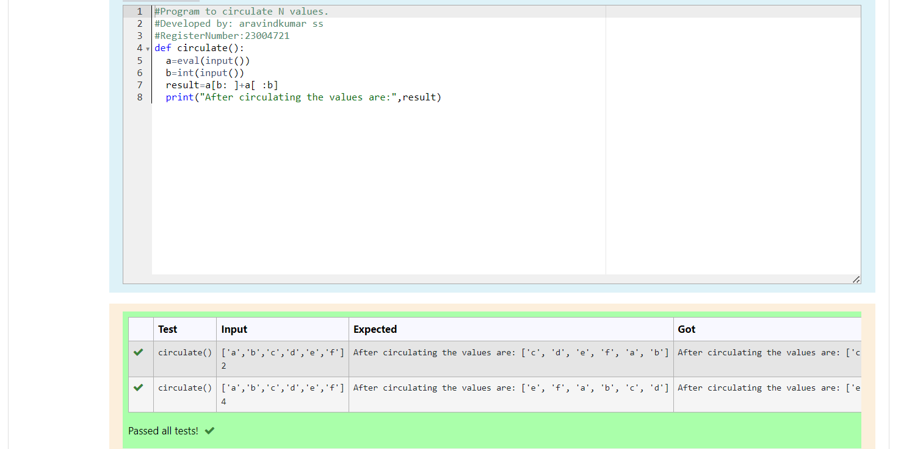

# Circulate-the-values-of-N-variables
## Aim:
To write a python program to circulate the n variables using function concept
## Equipment’s required:
PC
Anaconda - Python 3.7
## Algorithm: 
### Step 1:
Get the two value from the user
### Step 2: 
Assign the value of second variable to a temporary variable
### Step 3:
 Assign the value of first variable to a second variable
### Step 4: 
Assign the value of temporary variable to a first variable
### Step 5: 
print both the value it would be interchange
### Step 6: 
End the program
## Program:
```python
#Program to circulate N values.
#Developed by: aravindkumar ss
#RegisterNumber:23004721
def circulate():
  a=eval(input())
  b=int(input())
  result=a[b: ]+a[ :b]
  print("After circulating the values are:",result)
  ```

## Output:


## Result:
The ciculate a value of N variable is successfull exected
